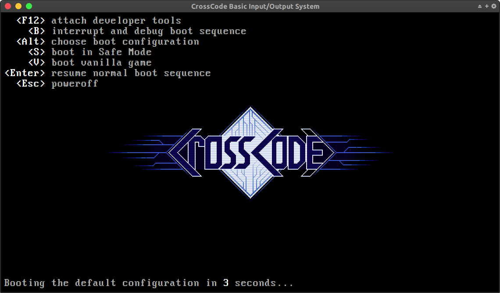

# crosscode-boot-screen

Font taken from: https://www.dafont.com/perfect-dos-vga-437.font

## Installation

1. download the source code and unpack (or use `git clone`) **inside** the CrossCode directory
2. change the `main` field in CrossCode's `package.json` to `crosscode-boot-screen/index.html`
3. (optional for _less authenticity_) to remove the "beep" sound append `?no-beep` to this path
